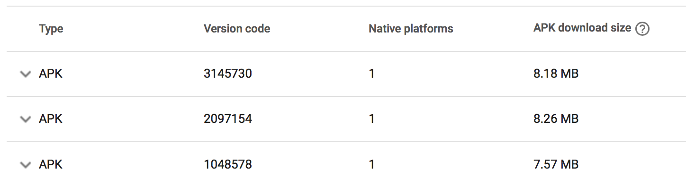

# DEVLOG

## 2020-05-17

It has been a long time since my last update to the codebase.

There are two main changes:

### Updated React-Native to `0.62.2`

React-Native 0.62 has been available for a couple of months now.  
The major highlights from this release are the new [Flipper](https://fbflipper.com/) developer tool being enabled by default, the dark-mode support shipped out-of-the box, and several other improvements and bug-fixes.

Updating Breathly to `react-native@0.62.2` was... well, definitely **not** painless.

#### The update

1. I started from the [web upgrade-helper](https://react-native-community.github.io/upgrade-helper/), updating by hand all the impacted files by checking each diff. A bunch of changes to the native codebase are required this time, mostly to support Flipper.
2. In this upgrade there's one main change that's very hard to implement by just checking the diffs: the `*.xcodeproj` file. Thanksfully, the web upgrade-helper links [a great thread](https://github.com/react-native-community/upgrade-helper/issues/191) describing in details each step involved in the file update.

#### Building iOS

3. Once done with the changes I cleaned up the xCode project, updated the pods and tried an iOS build. It failed. Duh.
4. First, I got a _"Use of undeclared identifier client"_ in the Flipper client. I was able to fix it following https://github.com/react-native-community/upgrade-support/issues/24.
5. Next, it was the turn of the _"Undefined symbol: \_swift_getFunctionReplacement"_, fixed following https://github.com/react-native-community/upgrade-support/issues/25.
6. At this point I was finally able to build the project and create a debug build.
7. I immediately tried building production one, and it "worked"... with a minor, problem: the IPA size is now double the size it was before (https://github.com/facebook/react-native/issues/28890). Everything seems to be working fine though 🤷‍♂️

### Building Android

8. I was able to immediately build successfully Android in debug mode. Unfortunately, the release build failed because it was still trying to bundle Flipper, but following https://github.com/facebook/react-native/issues/28736 I was able to fix it.

### Customization

The other main change I worked on is a new "custom" technique pattern.
I'm still not 100% convinced by the UI/UX, but I think it can still be a good starting point.

<p align="center" margin-bottom="0">
    
    
</p>

## 2019-10-11

- Updated React-Native to `0.61.2`: this has been a painless update 🙌
- Added sound effects for guided audio exercises. I personally requested and bought the audio voice lines from [voicebunny](https://voicebunny.com/p/10GUTaxhksaYXI-9jutm0hG0ku4hUZ-ta92slGswY4A~?p=pro-acq-inv).
- Automatically switch to dark/light mode theme based on the iOS 13 theme settings

## 2019-08-04

- Updated React-Native to `0.60.4` and the official hooks support.
- Added `react-native-keep-awake` to keep the screen on during the exercise.
- Tried to enable Hermes but [I discovered that it is not compatible with `abb` packages yet](https://github.com/facebook/react-native/issues/25927) - enabling makes the app freeze on the splash screen
- On iOS [there's an issue with the `0.60.4` RN default native tests that causes an error](https://github.com/facebook/react-native/issues/25911#issuecomment-517941867) when building in release mode. A PR to fix it has been merged into master but we don't know yet when it will be officially published. In the meanwhile you can manually patch the test file.

## 2019-03-11 First Release 🎉

### Project Structure

The directory structure of the project is the following:

```javascript
src
 ├── assets
 │   └── techniques // JSON data of the breathing techniques
 │        ├── awake.json
 │        ├── deep-calm.json
 │        └── ...
 │
 ├── components // The building blocks of the UI
 │   ├──  App
 │   │    ├── App.tsx
 │   │    ├── AppMain.tsx
 │   │    └── ... // Other "App" related components
 │   ├── ButtonAnimator
 │   │    ├── ButtonAnimator.tsx
 │   │    └── ... // Other "ButtonAnimator" related components
 │   ├── Exercise
 │   │    ├── Exercise.tsx
 │   │    ├── ExerciseCircle.tsx
 │   │    ├── ExerciseCircleDots.tsx
 │   │    ├── ExerciseCircleComplete.tsx
 │   │    └── ... // Other "Exercise" related components
 │   └── ...
 │
 ├── config
 │   ├── constants.ts // Constants used across the app
 │   ├── fonts.ts // Fonts settings definitions
 │   ├── images.ts // Exports all the images/icons used in the app
 │   ├── techniques.ts // Exports all the available techniques
 │   ├── themes.ts // Dark and light themes settings
 │   └── timerLimits.ts // Exports all available timer limits settings
 │
 ├── context
 │   └── AppContext.tsx // A Redux-like approach to state management
 │
 ├── hooks
 │   ├── useInterval.ts
 │   ├── useOnMount.ts
 │   └── useOnUpdate.ts
 │
 ├── types // TypeScript type definitions
 │
 └── utils // Common utils used across the app
```

A few interesting notes:

**Breathing techniques directory**

I preferred to not hard-code the breathing techniques in the app, they can be defined using the following JSON format:

```json
// ./src/assets/techniques/awake.json
{
  "id": "awake",
  "name": "Awake",
  "durations": [6, 0, 2, 0],
  "description": "Use this technique first thing in the morning for quick burst of energy and alertness.",
  "color": "#F1646C"
}
```

And are exported in [`src/config/techniques.ts`](./src/config/techniques.ts).

**Components directory**

The React components used in the app are grouped by context/usage:

- [`src/components/App`](./src/components/App): The entry point of the app, handles the app initialization and routing
- [`src/components/ButtonAnimator`](./src/components/ButtonAnimator): Animates the main screen button expansion
- [`src/components/Exercise`](./src/components/Exercise): Breathing exercise components
- [`src/components/Menu`](./src/components/Menu): Main menu components
- [`src/components/PageContainer`](./src/components/PageContainer): A few components to handle the top header used in the Settings/TechniquePicker screens (by wrapping them)
- [`src/components/Settings`](./src/components/Settings): Settings screen components
- [`src/components/StarsBackground`](./src/components/StarsBackground): The animated stars background
- [`src/components/TechniquePicker`](./src/components/TechniquePicker): Technique picker screen components

All the app components are exported using a named export (instead of the default export) because VSCode TypeScript auto-import works incredibly well with it.

### React Hooks

This was not my first test drive for the React hooks, I already had the chance to use them in a few other side projects in the past, and one of the main reasons I wanted to add them to this project was to create an abstraction hook over the Animated API to make the code cleaner and more re-usable.  
...and I failed.  
I tried a few different approaches, but I wasn't able to strike a balance between making it generic **and** flexible enough, so I just kept working with the plain Animated API.

### Libraries and app size

Breathly uses just a few external libraries to keep the bundle size to the minimum.  
The libraries used are:

- [`react-native-haptic`](https://github.com/AppAndFlow/react-native-haptic) to handle the haptic feedback on iOS.
- [`react-native-splash-screen`](https://github.com/crazycodeboy/react-native-splash-screen) to hide programmatically the native splash screen from JS.
- [`react-native-navigation-bar-color`](https://github.com/thebylito/react-native-navigation-bar-color) to programmatically change the Android navigation bar color from JS.

Might sound funny, but I had a some issues with all of these libraries.  
Luckily enough, I already worked with them in the past so I already knew some workarounds for solving them:

- `react-native-haptic` has [a missing podspec and is shipping the example with NPM](https://github.com/AppAndFlow/react-native-haptic/issues/9), so I'm using [this branch](https://github.com/AppAndFlow/react-native-haptic/pull/17) instead.
- `react-native-splash-screen` required manually linking the library on both iOS and Android and it also has [a few issues](https://github.com/crazycodeboy/react-native-splash-screen/issues/167) that must be solved before running it in production (making sure the assets aren't too big, adding a specific color to the `res`)
- For some reasons Gradle didn't like `react-native-navigation-bar-color`'s build file when building a release APK, so I just extreacted the interested native methods and added them directly in the native Android source code (hence why you won't see it in the `package.json`).

Being careful with the number of libraries was helpful to reduce the bundle size, but to keep it as small as possible on Android I also enabled ProGuard and the separate CPU architecture build.  
In this way the bundle size on Android is way smaller than a standard React-Native's app one (~8MB instead of ~20MB):

<p align="center" margin-bottom="0">
  <a href="https://breathly.app" target="_blank">
    
  </a>
</p>

Protip: Enable ProGuard and the separate CPU architecture split build from the beginning of your development: they might be incompatible with some code/libraries so by enabling them from start you'll be able to catch these issues soon.

### App performance

Even if Breathly is quite small I took care of the performance from its inception in a few different ways.

**Animations**  
To ensure good performance on the animations side I'm using the Native Driver on every single animation of the app. Again, I have previous experience on animations with the Native Driver, but there are a few things that can be a time sink for a newcomer:

- Try to not animate a text component (`Animated.Text`) directly: wrap it in an `Animated.View` instead. I'm not sure why but some animated values (`opacity` for example) won't work as you expect on an `Animated.Text` component on iOS.
- Make sure to check the `finished` parameter of the animation `start()` callback if you're planning to run some code when an animation ends: if you don't do so then the code will try to run even if the animation has been interrupted by a component unmount.
- Loops using the Native Driver can cause issues if they use `Animated.Sequence`: as a workaround you can implement [your own version of the loop](./src/utils/loopAnimations.ts).
- Do not give up: using the Native Driver puts a limit on what values you can animate but 99% of the time you **can** build your animation with them, or at least achieve a similar effect to what you want to do.

**Images**  
Just one rule of thumb here: don't load static assets from the JavaScript bundle.

Loading images from the JavaScript side (using `import`/`require`) from my experience is **way** slower than loading them from the native side.  
In Breathly all the images (logo, icons, background) are bundled as native resources on both iOS and Android. Bundling them as native resources ensures they're loaded as fast as possible, but it was also time consuming:

- I had to resize each asset multiple times for both iOS (`@2, @3`) and Android (`hdpi`, `xhdpi`, etc...)
- I'm keeping track of them in a [custom config file](./src/config/images.ts)
- For rendering the images I had to specify both `width` and `height` (you can't automatically render them based on a single width/height if they're imported from the bundle).

### State Management

There's not much to say about the app state management.  
I'm using `Context` + `useContext` + `useReducer` to keep track of the global state (see [`context/AppContext`](./src/context/AppContext.tsx)). Since I wanted to add side effects (storing to `AsyncStorage`) when dispatching some actions I ended up creating my own "action creators" as well.  
Am I happy to have built my own state management instead of going with Redux/MobX? Yes.  
Was it worth it? Honestly, I don't think so.  
I basically created a bunch of boilerplate code when I could have "just" used Redux (notice the irony) and its middlewares or MobX.

### UI and UX

I'm really interested in UI, UX and design patterns but I'm not a designer.
That said, I still tried to make the experience pleasant by taking care of a few small details and I'm also quite that I finally had a chance to manually design icons, splash screens and logo using Photosthop (you can find the PSDs in the [`.assets`](./.assets) dir).

**App icon**  
The app icon was the result of multiple iterations but I'm finally happy with the result:

- It's square and simmetrical so it can be easily re-used in other places (e.g.: the splash screen)
- It's not heavy on details
- The foreground "bubbles" can be used on different backgrounds (because the outer bubbles are using a lower opacity)

Since the icon is square, I was able to easily resize it to the iOS app standard and also to use it with the adaptive icon pattern on Android.

_I would have preferred a more "meaningful" icon but I wasn't able to find a less abstract concept to work on._

**Splash screen**  
Implementing the splash screen on iOS was quite easy using the XCode storyboard:

1. I created the splash screen background (`2732x2732`, to cover the widest side of the iPad Pro).
2. I created the splash screen foreground icon/image.
3. I placed both the background and foreground in an XCode storyboard and made sure that the foreground image keeps its aspect ratio and scales accordingly with the device size.
4. I made sure the Status Bar uses a light content during the splash screen.

On Android it was a different story:

1. I created the splash screen background.
2. I created the splash screen foreground icon/image.
3. I placed both the background and foreground in the Android `res` folder after resizing them manually
4. I orchestrated the background and foreground positioning using an XML layout
5. I made sure the Status Bar color matched the color of the foreground top (which is a vertical gradient) and that the Navigation Bar color matched the color of the foreground bottom.

The splash screen is programmatically hidden from the JS code only once the app has loaded all the data from the Async Storage: in this way if the user is using the "dark mode" he won't see a white flash after the splash screen.

**Status bar and navigation bar**  
The Status Bar and Navigation Bar (Android only) colors match the "screen color".

On iOS the Status Bar background is always transparent, I just had to change the Status Bar content color:

- During the splash screen the Status Bar content is white
- In the main menu the Status Bar content is black by default and white if the user is using the light mode
- In the exercise screen the Status Bar content is always white

On Android the Status Bar and the Navigation Bar have a solid background color (I didn't like the effect of the translucent background) that matches the screen color and their content works exactly like on iOS.

### App Store, Play Store, privacy and licensing

The app is available on both Apple's [App Store](https://itunes.apple.com/app/breathly/id1454852966) and Google's [Play Store](https://play.google.com/store/apps/details?id=com.mmazzarolo.breathly).  
I also created a [simple landing page](https://breathly.app). You can find the landing page source code [here](https://github.com/mmazzarolo/breathly-website).

The Breathly text font on iOS is San Francisco, while the text font on Android is Roboto.
I prefer the San Francisco one but it cannot be used on apps distributed on the Play Store.

To accomodate the release on the stores Breathly is license under the [Mozilla Public License](https://www.mozilla.org/en-US/MPL/).

Breathly doesn't use any third party software to track/log/debug the app usage.
