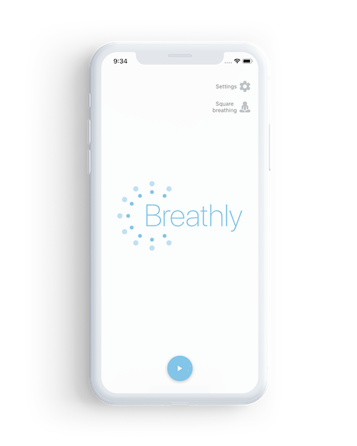
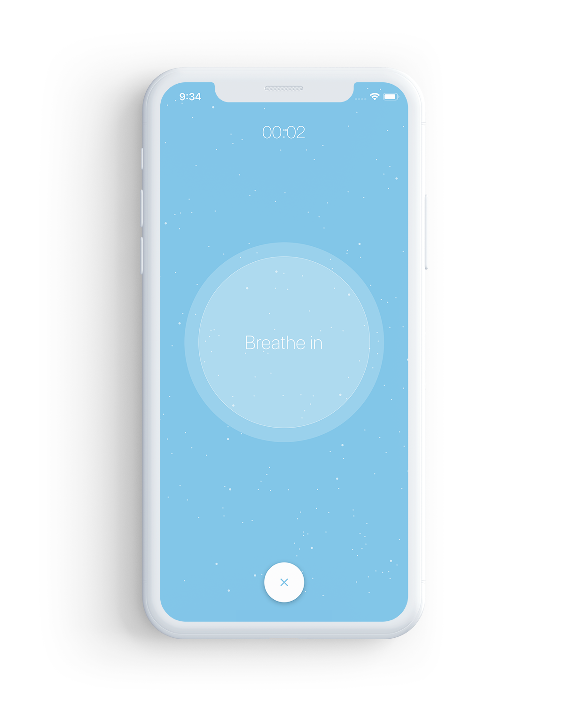

&nbsp;

# Breathly 

&nbsp;

Breathly is an open-source React-Native mobile app that allows you to focus on your breathing.
You can use Breathly for daily relaxation and breath training: just choose a breathing technique and focus on the guided exercise.

&nbsp;

  
  

  
  

  
  

  

## Overview

In this repository you'll find the source code of the Breathly mobile app.

Breathly is a tiny React-Native app that I developed in my free time to refine my React-Native knowledge and test new shiny things.

I hope the source code will be useful to someone.

## Android APK releases

Run the **Release Android APK** workflow from `master` to build and publish a signed Android APK and its
SHA-256 checksum in GitHub Releases. The workflow creates the `android-<version>-(<versionCode>)` tag from
the version code returned by EAS, so the tag always identifies the published APK.

Before the first release, configure a protected GitHub Environment named `release`, add an `EXPO_TOKEN`
environment secret that can access the configured EAS project, and require a reviewer for deployments.
Run `eas build:version:set --platform android` to initialize EAS remote version management with a version
code greater than every already distributed Breathly APK. Keep the EAS CLI version in `eas.json` and the
workflow in sync when upgrading it. An APK signed with a different key cannot update an installed F-Droid
version; uninstall that version before installing the GitHub APK.

## Resources and acknowledgements

- I created the app icon using [SVGWave](https://svgwave.in/) and edited using [Affinity Photo](https://svgwave.in/).
- I created and edited the App Store screenshots using [Screenshots.pro](https://screenshots.pro/).
- I created the Play Store screenshots by grabbing a few device mockups from [Mockuuups Studio](https://mockuuups.studio/) and editing them using [Affinity Photo](https://svgwave.in/).
- The breathing animation is a copy/paste of different breathing animation styles I've found online. Nothing fancy.
- The breathing techniques are the same ones used in a bunch of other iOS apps and their description were obtained with a Google search. A few of the apps used as inspirations are:
  - [Breathe+ Simple Breath Trainer](https://itunes.apple.com/us/app/breathe-simple-breath-trainer/id1106998959?mt=8)
  - [iBreathe – Relax and Breathe](https://itunes.apple.com/us/app/ibreathe-relax-and-breathe/id1296605806)
  - [Deep calm Daily breathing app](https://itunes.apple.com/us/app/daily-calm-deep-breathing-app/id1361009455?mt=8)
  - [Oak - Meditation & Breathing](https://itunes.apple.com/us/app/oak-meditation-breathing/id1210209691?mt=8)
- I personally requested and bought the audio voice lines from [voicebunny](https://voicebunny.com/p/10GUTaxhksaYXI-9jutm0hG0ku4hUZ-ta92slGswY4A~?p=pro-acq-inv).

## Contributing

Pull requests are welcome. File an issue for ideas, conversation or feedback.  
Please notice that, currently, I'm not keeping the F-Droid version up-to-date myself (nor I was the one who created it). That said, feel free to update it as needed and let me know if you need any help 👍
