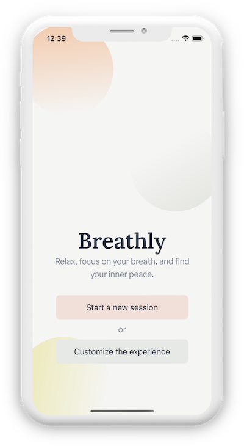

 

# Breathly 

 

Breathly is an open-source React-Native mobile app that allows you to focus on your breathing.
You can use Breathly for daily relaxation and breath training: just choose a breathing technique and focus on the guided exercise.

 

  

  
  

  
  

  <a href="https://breathly.app">Breathly App landing page</a>

## Overview

In this repository you'll find the source code of the Breathly mobile app.

Breathly is a small React-Native app that I developed on my free time in 2018 for playing around with the React-Native `Animated` API.  
With the incoming React-Native's hooks support I decided to get back on it, rewrite it with hooks, and also release it in the Play Store and in App Store.

I hope the source code will be useful to someone.

👉**Pleace check the [DEVLOG](./DEVLOG.md) for more informations and details about the app architecture and a few development highlights.**

### Features / Stack

- React-Native and TypeScript
- React hooks
- All the `Animated` animations are using the native driver
- Type-safe `Context` + `useReducer` usage (pretty similar to Redux)

### Resources and acknowledgements

Most of the stuff you see in the app is just a derivation of other people's work.  
I tried to keep track of them during the development process.

- The "play" button animation is based on a Switft custom modal transition called [BubbleTransition](https://github.com/andreamazz/BubbleTransition)
- For the Breathly logo I used [Hatchful](https://hatchful.shopify.com) to get a few proposed logos and I used [this one](./.github/breathly-hatchful-logo.png) as the building ground for the current one (build with PhotoShop)
- The technique picker View Pager animations are inspired by the InVision Android app onboarding screen
- I used [this mockup](https://gumroad.com/l/edFPQ) from [Lstore design goodies](https://gumroad.com/lstore) to create the iPhone X image that you can see at the top of the README.
- The breathing techniques are the same ones used in a bunch of other iOS apps and their description were obtained with a Google search. A few of the apps used as inspirations are:
  - [Breathe+ Simple Breath Trainer](https://itunes.apple.com/us/app/breathe-simple-breath-trainer/id1106998959?mt=8)
  - [iBreathe – Relax and Breathe](https://itunes.apple.com/us/app/ibreathe-relax-and-breathe/id1296605806)
  - [Deep calm Daily breathing app](https://itunes.apple.com/us/app/daily-calm-deep-breathing-app/id1361009455?mt=8)
  - [Oak - Meditation & Breathing](https://itunes.apple.com/us/app/oak-meditation-breathing/id1210209691?mt=8)
- I personally requested and bought the audio voice lines from [voicebunny](https://voicebunny.com/p/10GUTaxhksaYXI-9jutm0hG0ku4hUZ-ta92slGswY4A~?p=pro-acq-inv). 

## Contributing

Pull requests are welcome. File an issue for ideas, conversation or feedback.
